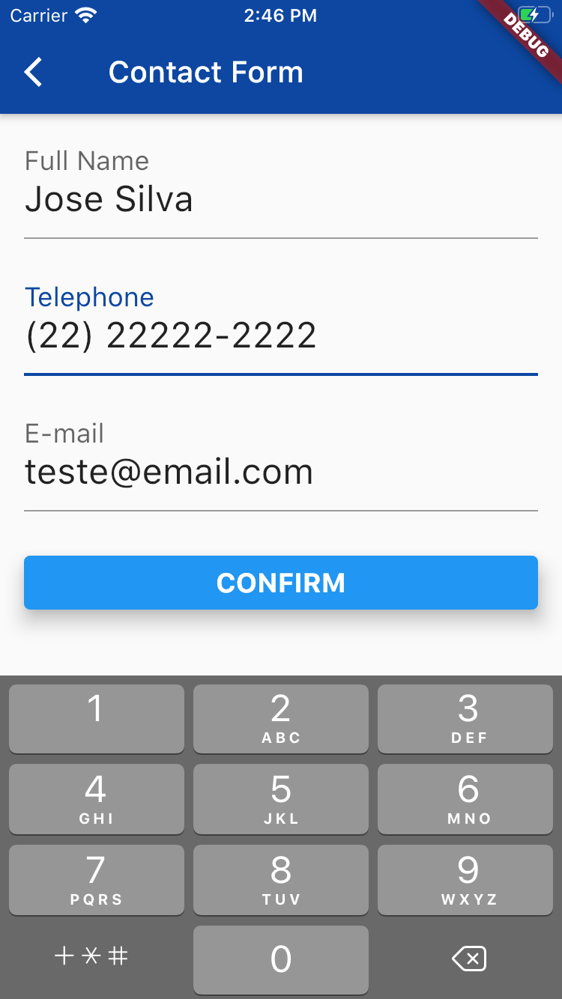

# flutter_persistence_example

Another project to learn about Flutter

I've implemented it based on a Flutter online course (Alura: https://cursos.alura.com.br/course/flutter-persistencia-interna)

- Persistence (sqflite)
- DAO - select and insert
- Async/await
- FutureBuilder
- Navigator
- mask_text_input_formatter (https://pub.dev/packages/mask_text_input_formatter)

- Tested in iOS, Android

## Screenshots:
### Android

  

    
  

  

    
  

  

    
  

### iOS

  

    
  

  

    
  

  

    
  

